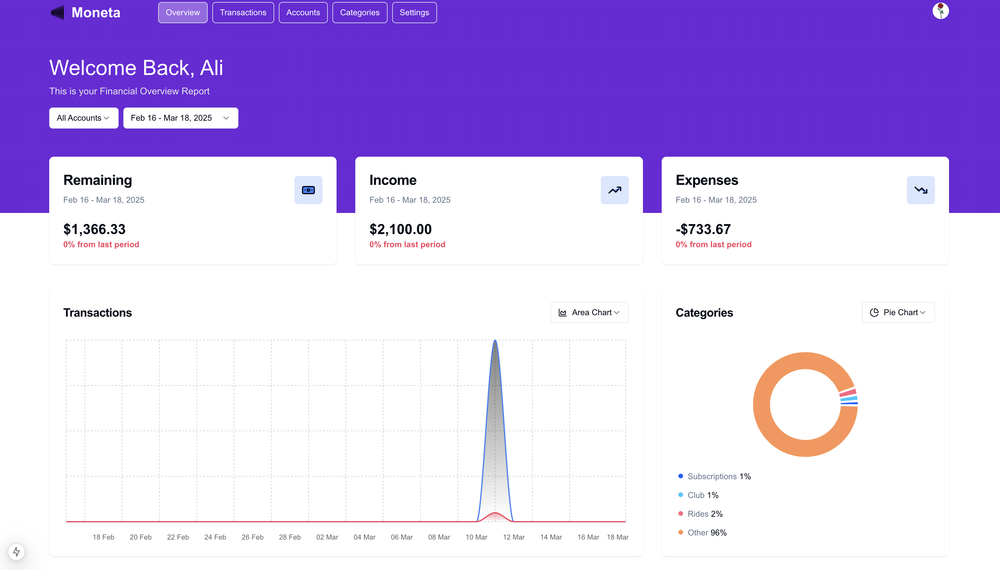
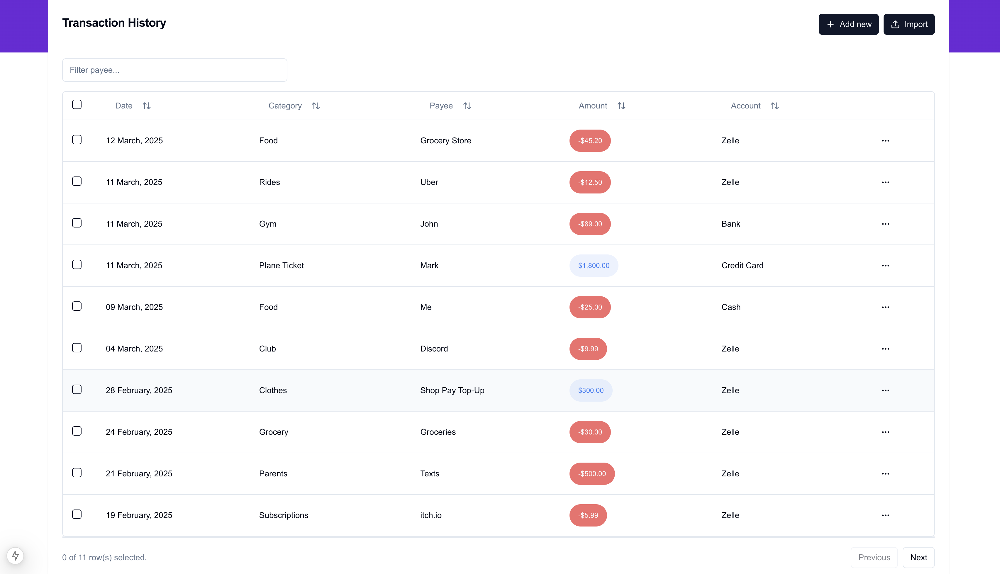
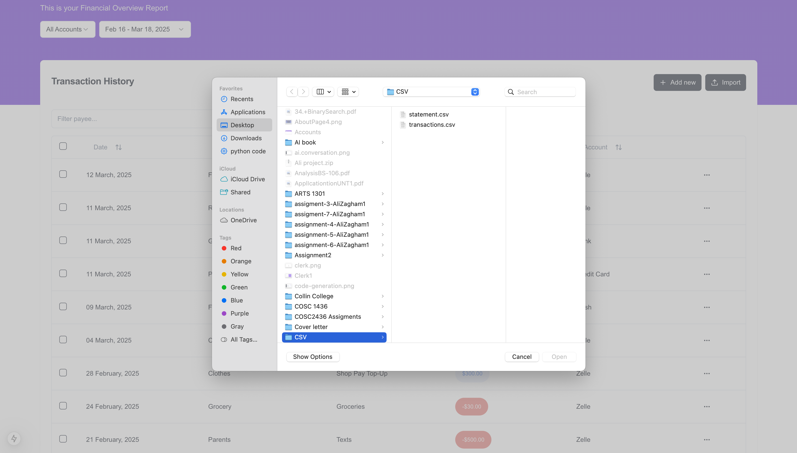
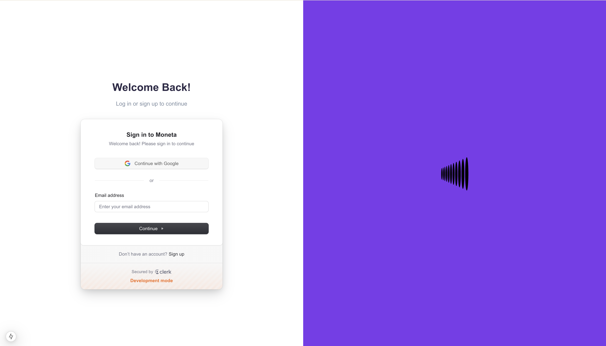
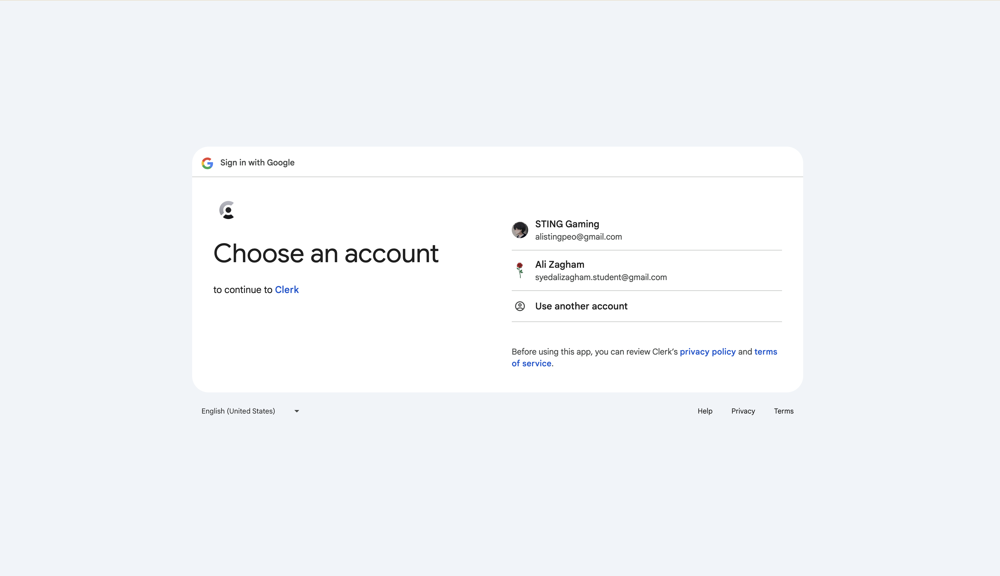

# Moneta - Personal Finance Dashboard 💰📊

Moneta is a smart personal finance tool designed to simplify expense tracking and budgeting. With features like real-time income vs. expenses analysis, interactive charts, CSV uploads, and secure authentication, it provides a seamless way to gain insights into financial habits.
---

## **📌 Key Features & Screenshots**

### **📊 Dashboard – Financial Overview**
The dashboard provides a **real-time financial summary**, including:
- **Income vs. Expenses** breakdown
- **Interactive charts & visualizations**
- **Remaining balance calculations**

---

### **📄 Transactions – Manage Your Finances**
Easily add, filter, and categorize transactions in the transactions page.
- **Filter by date range & account**
- **Search for specific transactions**
- **CSV Import for bulk uploads**

---

### **🏦 Accounts – Track Your Financial Sources**
View and manage **all linked accounts** in one place.
- **Categorized by Bank, Credit Card, and Digital Wallets**
- **Filter transactions by account**
- **Overview of balances per account**

---

### **🏷️ Categories – Expense Breakdown**
Organize expenses into categories to **better understand your spending habits**.
- **Visual category-wise expense distribution**
- **Automatic categorization with CSV uploads**
- **Custom category creation**

---

### **📂 CSV Upload – Bulk Transaction Management**
Upload transactions from a CSV file with **auto-categorization** and mapping.
- **Supports structured CSV file uploads**
- **Preview and validate data before import**

---

### **🔒 Secure Authentication with Clerk**
User authentication is powered by **Clerk**, enabling:
- **Sign in with Google**
- **Session management**
- **Secure user data storage**

🔹 **Login Page:**

🔹 **Google Authentication:**

---

## 🚀 Future Enhancements
- ✅ **Plaid Integration** – Automatically fetch transactions.  
- ✅ **Budgeting System** – Set spending limits.  
- ✅ **Multi-Currency Support**  